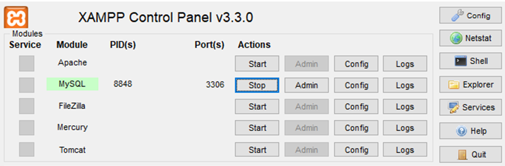

# SoCize - File Storage Server

**Final Year Project at [Asia Pacific University](https://apspace.apu.edu.my/)**

The server has to be setup before the client can be setup as there are stuff that the client needs that comes from the server.

SoCize is a secure file-handling module for social media-like environments, built to address growing concerns over data privacy. It allows users to **encrypt files locally** before uploading them to a server. The key idea is that **the server never has access to the unencrypted contents**—encryption and decryption happen entirely on the client side.

This repository includes the **client-side application** for encryption, decryption, and interaction with a backend server.  
> 🔗 The Java-Based Frontend is located here: [SoCize-Client GitHub Repo](https://github.com/YT-07/SoCize-Client.git)

---

## 📑 Table of Contents

- [Introduction](#introduction)
    - [Features](#features)
- [Installation Guide](#installation-guide)
    - [Prerequisites](#prerequisites)
    - [Steps to Run the Application](#steps-to-run-the-application)
- [Server-Side File Overview](#server-side-file-overview)
- [Contributors](#contributors)

---

## 🧩 Introduction

This project simulates how a social media platform can offer secure file sharing without exposing the content to the server.  
All encryption and decryption is done locally by the user.

The **PHP server acts only as a file storage manager**, providing basic services like file upload/download, user login, account management, and access control.

### 🚀 Features

#### Client-Side (Java Frontend)

- **Encrypt File**: Locally encrypt files using AES or similar before uploading.
- **Decrypt File**: Locally decrypt previously encrypted files using the correct key.
- **Interact with Server**: Upload/download/delete files and authenticate users.

#### Server-Side (This Repo)

- Store/retrieve encrypted files.
- Track file ownership.
- Allow **users** to:
  - Upload/download/delete their own files.
  - View their uploaded file list.
- Allow **admins** to:
  - View user accounts.
  - Delete user data (including files and credentials).
  - Monitor server health.

---

## ⚙️ Installation Guide

### Prerequisites

- PHP 8.x
- Apache/Nginx
- MySQL/MariaDB

### Steps to Run the Application

1. **Clone the repository**
```console
git clone https://github.com/Kur3nai/SoCize-Server.git
```

2. **Navigate to the project folder**
```console
cd SoCize-Server
```

3. **Open MySQL Workbench**
Launch the application and connect to your MySQL server.

Double-click your saved connection under "MySQL Connections" (or create one if needed).

4. **Open the SQL File**
Click File → Open SQL Script (or press Ctrl+O / Cmd+O).

Navigate to database query sql
```Consolde
SoCize-Server/Config/DatabaseQuery.sql
```

The file will open in a new SQL tab.

5. **Execute the SQL File**
Click the lightning bolt icon ("Execute") or press Ctrl+Shift+Enter.

Alternatively, run specific queries by highlighting them and clicking Execute.

6. . **Turn on MySQL on Xampp**
Make sure that MySQL is on so that the local host database can be accessed.




7. **Continue on client side after Setup is done**
 
---

## 📁 Server-Side File Overview

The screenshot below shows the contents of the PHP server backend:

| Filename              | Description |
|-----------------------|-------------|
| `AccountDetails.php`  | Retrieves or updates current user account details. |
| `AdminViewUser.php`   | Allows the admin to view all user accounts. |
| `DeleteFileData.php`  | Removes a file record and associated metadata from the database. |
| `DeleteUser.php`      | Deletes a user account and all associated files (admin-only). |
| `FileDownload.php`    | Allows users to download their previously uploaded (encrypted) files. |
| `FileUpload.php`      | Receives uploaded files from users; files are already encrypted by the client. |
| `GetFileRecords.php`  | Fetches a list of files uploaded by the authenticated user. |
| `LogIn.php`           | Handles user login and session creation. |
| `LogOut.php`          | Logs the user out by ending the session. |
| `ServerHealth.php`    | Simple ping to check server status. |
| `SignUp.php`          | Registers a new user account. |

> 🔐 **Note**: This server does not perform any file encryption or decryption. It only stores what the client sends and provides access control based on user roles (admin/user).

---

## 👥 Contributors

- **Lead PHP Developer**: [Adam Zikri] [Kur3nai](https://github.com/Kur3nai)
- **Database Designer**: [Ammar Razeeq Fouad] [Razeeku](https://github.com/Razeeku)
- **Institution**: Asia Pacific University of Technology & Innovation (APU)

---

